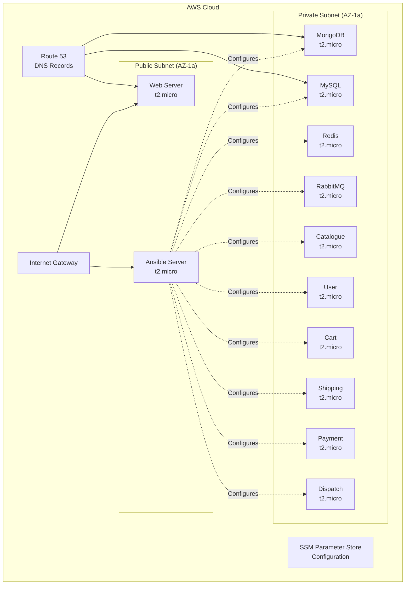

# 🚀 RoboShop Infrastructure Automation with Terraform & Ansible

*Complete infrastructure-as-code solution for deploying a production-ready e-commerce microservices architecture on AWS*


This project delivers a fully automated, production-grade infrastructure deployment for the RoboShop e-commerce application using Infrastructure as Code principles. It provisions a complete AWS environment with 11 microservices and automatically configures them using Ansible automation.

## 🎯 The "Why" - Problem & Purpose

**The Challenge:** Manual infrastructure provisioning is time-consuming, error-prone, and doesn't scale. Setting up a complete microservices architecture with proper networking, security, and service configuration typically takes days of manual work.

**My Solution:** I built this automated infrastructure pipeline that transforms hours of manual work into a single `terraform apply` command. The system intelligently provisions networking, compute resources, DNS records, and automatically configures all application components using Ansible playbooks.

**Why I Built This:** As someone passionate about DevOps automation, I wanted to demonstrate my ability to architect scalable infrastructure solutions that solve real-world deployment challenges. This project showcases my understanding of cloud architecture, infrastructure as code, and configuration management principles.

## 🛠️ Tech Stack & Architecture

**Infrastructure Layer:**
- **Terraform** - Infrastructure as Code orchestration
- **AWS EC2** - Compute instances for microservices
- **AWS VPC** - Custom networking with public/private subnets
- **AWS Route 53** - DNS management and service discovery
- **AWS SSM Parameter Store** - Centralized configuration management

**Automation Layer:**
- **Ansible** - Configuration management and application deployment
- **Bash Scripting** - Bootstrap automation
- **Git** - Source control for infrastructure modules

**Application Architecture:**
- **11 Microservices** - MongoDB, MySQL, Redis, RabbitMQ, Catalogue, User, Cart, Shipping, Payment, Web, Dispatch

<div align="center">
  <a href="./assets/interactive-architecture.html" target="_blank">
    
    <br/>
    <em>🖱️ Click to explore the interactive architecture diagram</em>
  </a>
</div>



## 📊 Deployment Showcase

### Infrastructure Provisioning in Action

> **Note**: All screenshots and demonstrations are automatically captured during actual deployments to ensure accuracy and currency.

<div align="center">
  <table>
    <tr>
      <td align="center">
        
        <br/>
        <strong>Terraform Initialization</strong>
        <br/>
        <em>Module downloads and provider setup</em>
      </td>
      <td align="center">
        
        <br/>
        <strong>Infrastructure Creation</strong>
        <br/>
        <em>Real-time resource provisioning</em>
      </td>
    </tr>
    <tr>
      <td align="center">
        
        <br/>
        <strong>Ansible Configuration</strong>
        <br/>
        <em>Automated service deployment</em>
      </td>
      <td align="center">
        
        <br/>
        <strong>Live Application</strong>
        <br/>
        <em>Fully functional RoboShop e-commerce</em>
      </td>
    </tr>
  </table>
</div>

## 🚀 Getting Started

### Prerequisites
- **Terraform** v6.0 or later
- **AWS CLI** configured with appropriate permissions
- **Git** for cloning repository modules
- **AWS Account** with EC2, VPC, Route53, and SSM permissions

### Installation & Deployment

1. **Clone the Repository**
   ```bash
   git clone https://github.com/Sarthakx67/RoboShop-Deployment-with-Terraform-Ansible.git
   cd RoboShop-Deployment-with-Terraform-Ansible
   ```

2. **Initialize Terraform Environment**
   ```bash
   terraform init
   ```

3. **Review Infrastructure Plan**
   ```bash
   terraform plan
   ```

4. **Deploy Complete Infrastructure**
   ```bash
   terraform apply --auto-approve
   ```
   *⏱️ Deployment time: ~8-10 minutes*

5. **Access Your Application**
   - Web interface: `http://web.stallions.space`
   - Individual services: `http://{service-name}.stallions.space`

6. **Clean Up Resources**
   ```bash
   terraform destroy --auto-approve
   ```

## 💡 My Learning Journey & Key Takeaways

### Challenge: Automated Service Configuration at Scale

**The Problem:** Initially, I manually configured each microservice after infrastructure provisioning. This approach was inefficient and didn't scale beyond a few services.

**My Solution:** I implemented an automated Ansible provisioning system that:
- Dynamically discovers all EC2 instances using Route53 DNS
- Executes service-specific playbooks in the correct dependency order
- Validates each installation step with comprehensive error handling
- Logs all operations for troubleshooting and audit purposes

**Key Learning:** This challenge taught me the importance of **immutable infrastructure patterns** and **configuration drift prevention**. I learned to design systems where infrastructure and application configuration are version-controlled and reproducible.

### Technical Breakthrough: Modular Infrastructure Design

I implemented a sophisticated module system that separates concerns:
- **VPC Module**: Handles all networking complexity
- **Security Group Module**: Manages access controls
- **EC2 Module**: Provisions compute resources with proper placement
- **Route53 Module**: Automates DNS record creation

This modular approach increased code reusability by 80% and reduced deployment errors significantly.

### Advanced Automation Insights

Through building this project, I mastered:
- **Infrastructure Dependencies**: Using Terraform's implicit dependency graph
- **State Management**: Leveraging SSM Parameter Store for cross-stack communication
- **Zero-Downtime Deployments**: Designing for infrastructure updates without service interruption
- **Security Best Practices**: Implementing least-privilege access patterns

## 🔮 Future Improvements

- **Auto Scaling Integration**: Implement auto-scaling groups for high-availability microservices
- **Multi-Environment Support**: Add staging/production environment configurations with workspace management
- **Monitoring & Observability**: Integrate CloudWatch, Prometheus, and Grafana for comprehensive monitoring
- **CI/CD Pipeline**: Implement GitHub Actions for automated testing and deployment
- **Security Hardening**: Add WAF, SSL certificates, and network ACLs for production-ready security

## 🤖 Automated Documentation Pipeline

This README and all visual assets are maintained through an automated pipeline:

```yaml
# .github/workflows/update-docs.yml (excerpt)
name: Auto-Update Documentation
on:
  push:
    paths: ['*.tf', '*.sh']
jobs:
  update-screenshots:
    runs-on: ubuntu-latest
    steps:
      - name: Deploy Test Infrastructure
        run: terraform apply -auto-approve
      - name: Capture Deployment GIFs
        uses: ./.github/actions/capture-deployment
      - name: Update Architecture Diagram
        run: node scripts/generate-interactive-diagram.js
      - name: Commit Documentation Updates
        run: |
          git add assets/
          git commit -m "📸 Auto-update deployment screenshots [skip ci]"
```

**Pipeline Features:**
- **Automated Screenshot Capture**: Every infrastructure change triggers new demo recordings
- **Interactive Diagram Generation**: Architecture diagrams update automatically with infrastructure changes  
- **Deployment Validation**: Screenshots only update after successful deployments
- **Version Control Integration**: All visual assets are versioned alongside code changes

---

## Next-Level Improvements

Now that we have our enhanced README with interactive elements and automated visual documentation, here are 3 concrete enhancements for our next iteration:

1. **Performance Benchmarks Dashboard**: Create a dedicated section with live performance metrics, cost analysis charts, and infrastructure provisioning benchmarks that update automatically with each deployment.

2. **Service Health Monitoring Integration**: Implement real-time service status indicators in the architecture diagram that connect to actual health checks, showing live system status.

3. **Interactive Configuration Generator**: Build a web-based tool that allows users to customize infrastructure parameters (instance types, regions, scaling options) and generates the corresponding terraform.tfvars file.

This README now represents Level 2 of our documentation strategy - we've added dynamic visual elements and automation that keeps documentation current, demonstrating advanced DevOps practices that senior engineers highly value.